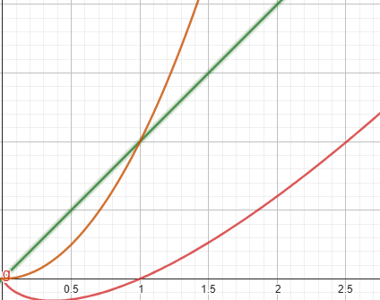
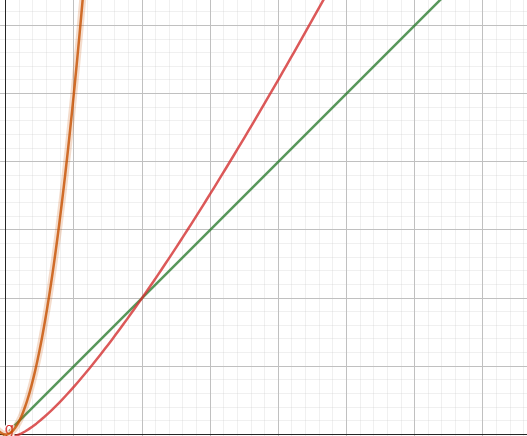

# Revisão para a primeira prova

## Introdução a análise de algoritmos

Existem modelos para representarmos os algoritmos de forma teórica e assim determinar seu tempo de execução com base no tamanho da **instância** (tamanho da entrada).

### Máquina de Turring 

 Ela consiste em uma fita infinita dividida em células, que podem conter símbolos, e um cabeçote que lê e escreve esses símbolos na fita, movendo-se para a esquerda ou para a direita. A máquina segue um conjunto de regras (uma tabela de transição) baseado no símbolo atual e no estado da máquina.

**OBS:** A movimentação na máquina de Turring e os acessos a memória devem ser feitos de forma linear.

#### Tese de Church-Turing

Toda a função que pode ser calculada por um procedimento finito pode também ser computada por uma máquina de Turing. 

### Modelo RAM(Random Acess Memory)

Simplifica a análise ao ignorar detalhes específicos de hardware, permitindo que os algoritmos sejam avaliados de maneira independente da implementação física.

Componentes principais do modelo RAM:
Memória: Consiste em células de memória indexadas que podem armazenar números inteiros. O acesso a qualquer célula de memória é feito em tempo constante, ou seja, O(1).

Instruções: O modelo suporta um conjunto básico de instruções, como atribuição, aritmética (adição, subtração, etc.), comparações, e controle de fluxo (como loops e condicionais). Cada instrução é executada em tempo constante.

Unidade de Controle: Controla a execução das instruções, movendo-se sequencialmente ou saltando para diferentes partes do programa com base nas instruções de controle de fluxo.

## Complexidade de tempo x Complexidade de espaço

* Complexidade de Tempo: mede o tempo total de execução de um algoritmo em função do tamanho da entrada.

* Complexidade de Espaço: mede o quanto de memória um algoritmo irá usar em função do tamanho da sua entrada durante o tempo de execução.

## Comparação entre Algoritmos lineares, n*log(n) e quadráticos

Para exemplificar de forma mais interessante irei usar gráficos com o o eixo **x** representando a entrada e o eixo **y** o tempo de execução em função da entrada;

---
Zoom mais ampliado



---

Zoom mais afastado




legenda: 
* curva amarela = crescimento quadrático.
* curva verde = crescimento linear.
* curva vermelha = crescimento n*log(n).

---

Observe que dependendo do número da entrada a priori um tempo de execução pode até ser mais rápido do que o outro, no entanto conforme aumentamos a instância dentre os 3 podemos ver que o algoritmo linear é o que executa em menos tempo.

## Complexidade de Tempo e Espaço em Algoritmos Simples Usando o Modelo RAM

### 1. Busca Linear em um Array

**Problema**: Dado um array de tamanho `n` e um valor `x`, determinar se `x` está presente no array.

**Algoritmo**:

```c
int busca_linear(int arr[], int n, int x) {
    for (int i = 0; i < n; i++) {
        if (arr[i] == x) {
            return i;
        }
    }
    return -1; // x não encontrado
}
```

Complexidade de Tempo:

No modelo RAM, cada operação básica (como comparação, incremento do índice, etc.) é considerada de tempo constante, `O(1).`
O loop itera n vezes no pior caso, onde n é o tamanho do array.
Portanto, a complexidade de tempo é `O(n)`.

Complexidade de Espaço:

O algoritmo utiliza espaço adicional apenas para as variáveis i e x, ambas ocupando espaço constante `O(1).`

Não é utilizada memória adicional proporcional ao tamanho do vetor, então a complexidade de espaço é 
`O(1)` ou seja, linear.

### Soma de Todos os Elementos de um Array

**Problema:** Dado um array de tamanho `n`, calcular a soma de todos os seus elementos.

**Algoritmo**

```C 
int soma_array(int arr[], int n) {
    int soma = 0;
    for (int i = 0; i < n; i++) {
        soma += arr[i];
    }
    return soma;
}
```

Complexidade de Tempo:

Novamente, cada operação básica (como adição e incremento do índice) é de tempo constante O(1).
O loop itera n vezes, portanto a complexidade de tempo é `O(n)`.

Complexidade de Espaço:

O espaço adicional utilizado é para as variáveis soma e i, que ocupam espaço constante O(1).
Assim, a complexidade de espaço é `O(1)`.

### Exemplo: Cálculo do Fatorial

**Problema**: Calcular o fatorial de um número `n`, onde o fatorial de `n` (denotado por `n!`) é o produto de todos os números inteiros positivos até `n`.

**Algoritmo**:

```c
int fatorial(int n) {
    if (n == 0) {
        return 1;
    } else {
        return n * fatorial(n - 1);
    }
}
```


Aqui está um exemplo de um algoritmo recursivo, com explicação de sua complexidade de tempo e espaço, formatado em Markdown:

markdown
Copiar código
## Complexidade de Tempo e Espaço em um Algoritmo Recursivo Usando o Modelo RAM

### Exemplo: Cálculo do Fatorial

**Problema**: Calcular o fatorial de um número `n`, onde o fatorial de `n` (denotado por `n!`) é o produto de todos os números inteiros positivos até `n`.

**Algoritmo**:

```c
int fatorial(int n) {
    if (n == 0 || n == 1) {
        return 1;
    } else {
        return n * fatorial(n - 1);
    }
}
```

Complexidade de Tempo:

Cada chamada recursiva realiza uma multiplicação, que é uma operação de tempo constante 
O(1).
O algoritmo faz n chamadas recursivas, onde cada chamada resolve um subproblema de tamanho n - 1, n - 2, e assim por diante até n = 0.
Portanto, a complexidade de tempo é 
`O(n)`, já que o tempo de execução cresce linearmente com o valor de n.

Complexidade de Espaço:

A complexidade de espaço depende do número de chamadas recursivas que ficam na pilha de execução (call stack) ao mesmo tempo.
Em cada chamada recursiva, uma nova instância da função é empilhada, consumindo espaço para as variáveis locais e a própria chamada.
No pior caso, a profundidade da recursão é n, então a complexidade de espaço é `O(n)`.

Observe que a complexidade de espaço O(n) é devido ao armazenamento das chamadas recursivas na pilha, e não devido ao uso de memória adicional para variáveis.

## Diferenças entre a análise teórica e a experimental

A análise assintótica de algoritmos pode ser abordada de duas maneiras principais: teórica e experimental. Cada uma tem seu propósito e contribui de forma diferente para a compreensão da eficiência de um algoritmo. Aqui estão as diferenças principais entre essas duas abordagens:

### Análise Teórica

#### Definição:

A análise teórica é uma abordagem matemática e formal para avaliar a complexidade de um algoritmo. Ela foca em determinar as funções que descrevem o tempo de execução ou o uso de espaço em termos do tamanho da entrada n, sem executar o algoritmo.

#### Características:

* Notação Assintótica: Utiliza notações como O, Ω, e Θ para descrever os limites superior, inferior e exato, respectivamente, do crescimento da função de complexidade conforme o tamanho da entrada aumenta.

* Independência do Hardware: A análise é feita de forma abstrata, sem levar em consideração fatores específicos de hardware ou implementação, como cache, arquitetura do processador, etc.

* Generalidade: Fornece uma visão ampla do comportamento do algoritmo para entradas de tamanho grande.

* Provas Matemáticas: Baseia-se em argumentos matemáticos e provas formais para justificar as conclusões sobre a complexidade de tempo e espaço.

#### Vantagens:

Pode ser usada para comparar algoritmos independentemente da máquina em que serão executados.
Identifica os piores cenários, melhores cenários e comportamentos típicos de um algoritmo.
Desvantagens:

Pode ignorar fatores práticos que afetam o desempenho real, como otimizações de compiladores ou peculiaridades do sistema operacional.

### Análise Experimental

#### Definição:

A análise experimental envolve implementar e executar o algoritmo em um ambiente controlado para medir empiricamente o tempo de execução e o uso de memória em diferentes cenários.

#### Características:

* Execução Real: O algoritmo é executado em um computador real ou em um simulador para medir diretamente seu desempenho.

* Dados Empíricos: Gera dados sobre o tempo de execução real e o uso de memória para diferentes tamanhos de entrada.

* Dependência do Hardware: O desempenho observado pode depender fortemente das características do hardware e do ambiente de execução (como CPU, memória, sistema operacional).

* Variação de Cenários: Pode testar o algoritmo em diferentes tipos de entradas, incluindo casos médios, piores e melhores.

#### Vantagens:

Fornece uma visão prática e realista do desempenho do algoritmo.
Pode revelar comportamentos inesperados ou ineficiências que não seriam aparentes na análise teórica.

#### Desvantagens:

Os resultados são específicos para o ambiente de teste, e podem não se generalizar bem para outros sistemas.

Pode ser difícil executar experimentos suficientemente abrangentes para capturar todos os possíveis cenários de uso.

## Conceitos de Melhor, Pior e Caso Médio na Análise de Algoritmos

### Melhor Caso (Best Case)

**Definição**: 
- O melhor caso representa o cenário em que o algoritmo executa o menor número possível de operações. É o cenário mais favorável para o algoritmo em termos de tempo de execução ou uso de espaço.

**Exemplo**:
- Em uma busca linear em um array, o melhor caso ocorre quando o elemento procurado é o primeiro elemento do array. Neste caso, o algoritmo faz apenas uma comparação, resultando em uma complexidade de tempo \(O(1)\).

**Uso**:
- Embora útil para mostrar a eficiência máxima de um algoritmo, o melhor caso raramente é o foco principal na análise, pois ele ocorre com pouca frequência em aplicações reais.

### Pior Caso (Worst Case)

**Definição**:
- O pior caso representa o cenário em que o algoritmo executa o maior número possível de operações. É o cenário mais desfavorável para o algoritmo, onde ele leva mais tempo ou usa mais espaço para completar sua tarefa.

**OBS:** Se um algoritmo é rápido até mesmo no seu pior caso ele é rápido nas outras ocasiões.

**Exemplo**:
- Na busca linear, o pior caso ocorre quando o elemento procurado está no final do array ou não está presente. O algoritmo precisa verificar todos os elementos do array, resultando em uma complexidade de tempo \(O(n)\), onde `n` é o tamanho do array.

**Uso**:
- A análise do pior caso é crucial porque garante que, independentemente da entrada, o algoritmo não será pior do que o limite calculado. É fundamental para sistemas que requerem garantias de desempenho.

### Caso Médio (Average Case)

**Definição**:
- O caso médio considera o tempo de execução ou o uso de espaço do algoritmo para uma entrada "típica". Ele calcula a média das complexidades para todas as entradas possíveis, assumindo que todas as entradas têm igual probabilidade de ocorrer.

**Exemplo**:
- Na busca linear, se o elemento procurado estiver em uma posição aleatória no array, o algoritmo, em média, terá que verificar cerca de metade dos elementos. Isso resulta em uma complexidade de tempo \(O(n/2)\), que é simplificada para \(O(n)\).

**Uso**:
- A análise do caso médio é útil para entender o comportamento do algoritmo na prática, onde as entradas podem ser variadas e não necessariamente extremas. No entanto, determinar o caso médio pode ser difícil, pois depende de uma distribuição de probabilidade precisa das entradas.

---

### Resumo

- **Melhor Caso**: Representa o cenário mais favorável para o algoritmo (complexidade mínima).
- **Pior Caso**: Representa o cenário mais desfavorável (complexidade máxima).
- **Caso Médio**: Representa a complexidade esperada para uma entrada típica (média das complexidades).

## Notações Assintóticas

### Notação Big O

Representa um limite superior para uma função.

Seja por exemplo que f(n) = O(n)

Uma função pode ser considera desse tipo se exista uma constante positiva tal que 
$$ f(n) <= c * g(n) $$

para todo n0 > 0 .

### Notação Ω

Representa um limite inferior para uma função.

Seja por exemplo que f(n) = Ω(n)

Uma função pode ser considerada desse tipo se exista uma constante positiva tal que 
$$ f(n) >= c * g(n) $$

para todo n0 > 0 .

### Notação Θ 

Representa um limite inferior e superior ao mesmo tempo para uma função.

Seja por exemplo que f(n) = Θ (n)

Uma função pode ser considerada desse tipo se exista uma constante positiva tal que 
$$ c1 * g(n) <= f(n) <= c2 * g(n) $$

para todo n0 > 0 .

### Notação o

Representa um limite estritamente inferior para uma função.

Seja por exemplo que f(n) = o (n)

Uma função pode ser considerada desse tipo se exista uma constante positiva tal que 
$$ f(n) < c * g(n) $$

para todo n0 > 0 .

outra forma de vermos isso é se
$$
\lim_{n \to \infty} \frac{f(x)}{g(x)} = 0
$$


### Notação w

Representa um limite estritamente superior para uma função.

Seja por exemplo que f(n) = w(n)

Uma função pode ser considerada desse tipo se exista uma constante positiva tal que 
$$ f(n) > c * g(n) $$

para todo n0 > 0 .

outra forma de vermos isso é se
$$
\lim_{n \to \infty} \frac{f(x)}{g(x)} = \infty
$$


## Propriedades das notações assintóticas - RESUMO

* Reflexividade: 
f(n)=O(f(n)).
*Transitividade: Se f(n)=O(g(n)) e g(n)=O(h(n)), então f(n)=O(h(n)).

* Adição: 

continua...