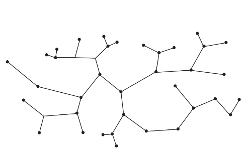

# Revisão prova 4

# Continuação problema da mochila

## Relaxação da capacidade

É uma das formas que temos para diminuir e cortar as subárvores que não irão produzir uma solução melhor do que a encontrada até o momento.

Essa relaxação consiste em colocar todos os itens restantes na mochila. 

### Exemplo

Temos o seguinte caso de problema da mochila:

    Valores = [1,3,6,8]

    Pesos = [1,2,3,2] 

    Capacidade = 4

Considerando que em uma das subárvores a solução está em [1,0,*,*] o limite superior por esse tipo de relaxação é `1+6+8 = 15`.

Esse tipo de limitante é na maioria dos casos ineficiente, pois geralmente a solução e ele ficam muito distantes um do outro.

## Relaxação linear

A precisão desta é melhor, e funciona da seguinte forma:

Ordenamos os itens por densidade, dividindo o valor pelo peso e em seguida resolvemos o que resta da capacidade utilizando o problema da mochila fracionária.

$$
d_i = \frac{v_i}{p_i}
$$

### Exemplo 

Considerando o mesmo exemplo e instância anterior.

As densidades restantes ficam:

$$
[ \frac{6}{3}, \frac{8}{2}]
$$
$$
[2, 4]
$$

Ordenando em ordem decrescente temos:
$$
[4, 2,]
$$
Agora colocamos o possível de itens na capacidade que restou nessa possível solução `C = 3`:

$$
V = 1 + 8 + \frac{6}{3} \cdot 1
$$
$$
V = 11
$$

Com isso o valor máximo que os valores de solução dessa subárvore é 11.

# Subsequência comum mais longa

Verifica a subsequência mais longa entre duas strings.

    x = D A B C B B A A C 
    Y = B B A D B C D 

Subsequência comum: **B B A C** 

Esse problema pode ser resolvido por meio da programação dinâmica, e sua equação de recorrência característica é dada por:

Para i,j: LCS de x[1..i] e x[1..j] e o tamanho da LCS é C[i,j].

    C[i,0] = C[0,j] = 0 // linhas e colunas iniciais são 0
    C[i,j] = C[i-1.j-1] + 1 // se x[i] = y[j]
    C[i,j] = max {C[i-1.j],C[i,j-1]} // se x[i] != y[j]

# Tentativa e erro (Backtracking)

Vamos tentando as soluções possíveis para o problema, até encontrar uma solução ótima ou quando o problema é muito grande, achar uma solução satisfatória.

Se o próximo passo atende aos requisitos do problema continuamos, caso contrário voltamos ao passo anterior e exploramos as outras possibilidades deste.

# Grafos

Grafos são estruturas de dados que possuem vértices e arestas, e têm muitas aplicações no cotidiano, como por exemplo na aviação, coloração de mapas e planejamento urbano.

## Definições

G = (V , A)

+ V é um conjunto fnito (vértices)
+ A é um conjunto de pares de elementos de V (arestas)

### Complemento de um grafo

Considerando um grafo G, seu complemento é o grafo que possui todas as arestas que G não possui.

De forma mais formal:

G` = {{u,v}:{u,v} $\notin$ G }

### Grafos completos

São aqueles que possuem todas as arestas possíveis para o seu número de vértices

### Percursos em grafos

+ Caminho: não repete arestas
+ Passeio ou circuito: o primeiro e o último vértice coincidem, podem repetir arestas.
+ Circuito/ passeio Euleriano: um passeio que contém cada aresta do grafo exatamente uma vez.
+ Ciclo: circuito que não repete arestas e nem vértices
+ Ciclo Hamiltoniano: Ciclo que contém todos os vértices do grafo somente uma vez.

### Grafo Hamiltoniano
Grafo que possui um ciclo hamiltoniano.

### Árvore

Grafo conexo e sem ciclos.

### Grau de um vértice

Quantidade de arestas que entram ou saem de um vértice.

### Folhas

Vértices de grau 1.

## Grafos usando listas de adjacência e matrizes de adjacência

Para ver mais detalhes e as implementações de grafos: [clique aqui](https://github.com/Gabriel-E-S/UEPG/tree/main/Estrutura%20de%20Dados%20II/Grafos)

# Referências

Parte do conteúdo e imagens é do material do proferror Jaime Cohen.
