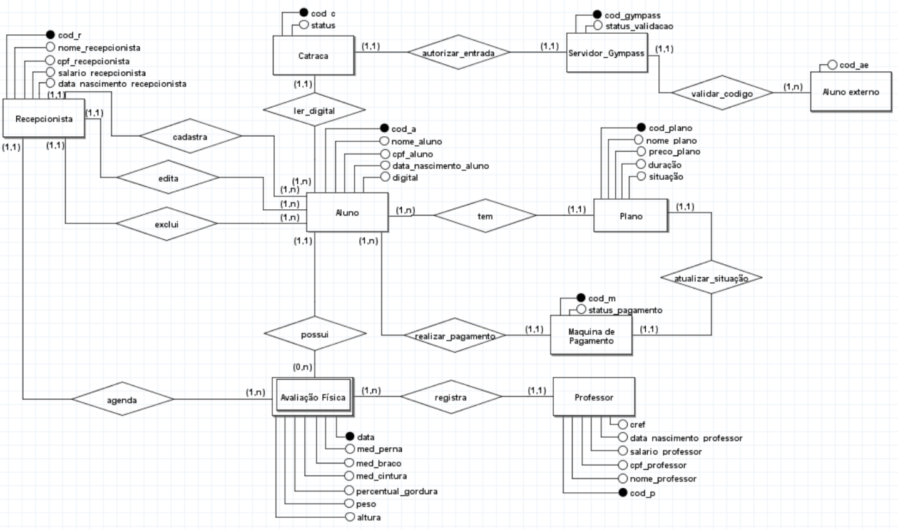

# Banco de Dados

Nesse repositório irei colocar os códigos referente ao trabalho final da disciplina, que consistiu em fazer a modelagem de um sistema de banco de Dados de uma academia, com todos os requisitos e detalhes citados a seguir:

# Enunciado criado por nós

Uma rede de academias deseja informatizar seu processo de gestão por meio de
um sistema de gerenciamento acadêmico. Esse sistema envolve diferentes
integrantes: alunos, professores, recepcionistas e um servidor externo responsável
pela integração com o Gympass.
O processo de cadastro de alunos é realizado exclusivamente pela recepcionista.
Para cada aluno, devem ser armazenados os seguintes dados:

+ Nome completo
+ CPF
+ Data de nascimento
+ Registro da digital
+ Plano contratado (cada aluno pode estar vinculado a apenas um plano ativo
por vez)

O acesso dos alunos à academia é feito por meio de catracas, que possuem um
leitor biométrico. Esse dispositivo identifica a digital cadastrada e verifica se o plano
associado ao aluno está ativo (“em dia”). Caso esteja regular, a entrada é liberada.
Além disso, alunos que não se cadastraram diretamente na academia podem
acessar as instalações utilizando o Gympass. Nessa modalidade, o servidor externo
gera um código único de acesso para cada visita, que é validado pelo sistema da
academia no momento da entrada.

Para acompanhamento da evolução do aluno, o sistema deve registrar avaliações
físicas periódicas. O agendamento dessas avaliações é feito pela recepcionista,
enquanto o professor é responsável por lançar os resultados no sistema. Os
atributos registrados em cada avaliação são: altura, peso, percentual de gordura,
medida da cintura, dos braços e das pernas.

O pagamento dos planos é realizado presencialmente, utilizando cartão de crédito
na máquina de pagamento da academia. Quando o sistema confirma a transação, o
estado do plano do aluno passa automaticamente para “em dia”.

Por fim, o sistema deve permitir à recepcionista editar ou excluir cadastros de
alunos sempre que necessário.

# Modelo entidade relacionamento obtido:

# Modelo Relacional

Recepcionista(cod_r, nome_recepcionista, cpf_recepcionista, salario_recepcionista,
data_nascimento_recepcionista)

Catraca(cod_c, status, cod_gympass)

Aluno(cod_a, nome_aluno, cpf_aluno, data_nascimento_aluno, digital, cod_r,
cod_c, cod_m, cod_plano)

Aluno_externo(cod_ae, cod_gympass)

Servidor_Gympass(cod_gympass, status_validacao)

Maquina_de_Pagamento(cod_m, status_pagamento, cod_plano)
Professor(cod_p, cref, data_nascimento_professor, salario_professor,
cpf_professor, nome_professor)

Avaliação_Física(data, cod_a, med_perna, med_braço, med_cintura,
percentual_gordura, peso, altura, cod_r, cod_p)

Plano(cod_plano, nome_plano, preco_plano, duração, situação)

# Implementação SQL

Foi utilizado o SGBD PostgreeSQL, as implementações seguem nos arquivos .sql.