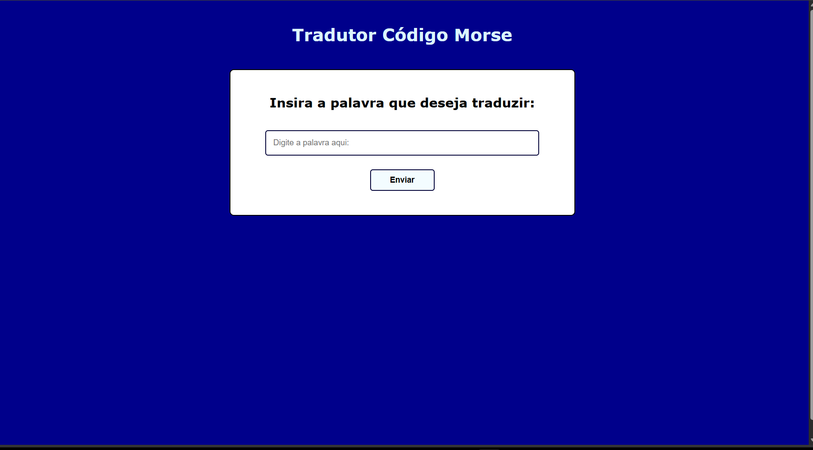
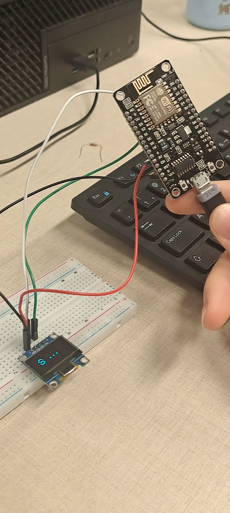

# 📟 Conversor Web para Código Morse com ESP8266 e Tela OLED

Este projeto é uma API em um microcontrolador **ESP8266** que recebe textos via rede Wi-Fi (usando a Fetch API do JavaScript), converte a mensagem para **Código Morse**, pisca o LED embutido da placa e exibe uma interface gráfica com as letras e símbolos em tempo real em um **Display OLED (SSD1306)**.

## 🛠️ Hardware Necessário

* **1x** Placa ESP8266 (NodeMCU 1.0, Wemos D1 Mini, etc.)
* **1x** Display OLED 0.96" (Controlador SSD1306 - Comunicação I2C)
* **4x** Jumpers (fios) Fêmea-Fêmea
* **1x** Cabo Micro-USB (deve suportar transferência de dados, não apenas energia)

### Esquema de Ligação (Wiring)

| Pino do Display OLED | Pino no ESP8266 | Função |
| :--- | :--- | :--- |
| **GND** | **GND / G** | Negativo (Terra) |
| **VCC (ou VDD)** | **3V3** | Alimentação (3.3V) |
| **SCL (ou SCK)** | **D1** | Clock do I2C |
| **SDA** | **D2** | Dados do I2C |

---

## 💻 Dependências e Instalação (Arduino IDE)

Para compilar e rodar este código, você precisará configurar a Arduino IDE e instalar os pacotes de placa e bibliotecas listados abaixo.

### 1. Suporte à Placa ESP8266
A Arduino IDE não vem com suporte nativo ao ESP8266. Para adicioná-lo:
1. Vá em **Arquivo > Preferências**.
2. No campo "URLs do Gerenciador de Placas Adicionais", cole o seguinte link:
   `http://arduino.esp8266.com/stable/package_esp8266com_index.json`
3. Vá em **Ferramentas > Placa > Gerenciador de Placas...**.
4. Pesquise por `esp8266` e instale o pacote **"esp8266 by ESP8266 Community"**.

### 2. Bibliotecas Necessárias
As bibliotecas que gerenciam o Wi-Fi e o Servidor Web (`ESP8266WiFi.h` e `ESP8266WebServer.h`) já vêm embutidas ao instalar o suporte da placa no passo anterior.

No entanto, para o Display OLED funcionar, você deve instalar as bibliotecas da Adafruit.
Vá em **Rascunho > Incluir Biblioteca > Gerenciar Bibliotecas...** e instale as seguintes:

* **Adafruit SSD1306**: Biblioteca principal que se comunica com o chip do visor.
* **Adafruit GFX Library**: Biblioteca gráfica base para desenhar textos, linhas e formas.
*(Nota: Se a IDE perguntar se você deseja instalar dependências adicionais como a "Adafruit BusIO", clique em **Install All**).*

---

## 🚀 Como Usar

1. Abra o arquivo `.ino` na Arduino IDE.
2. Altere as variáveis de rede nas linhas iniciais com as credenciais do seu Wi-Fi:
   ```cpp
   const char* ssid = "NOME_DO_SEU_WIFI";
   const char* password = "SENHA_DO_SEU_WIFI";
Conecte o ESP8266 ao computador, selecione o modelo correto (ex: NodeMCU 1.0 (ESP-12E Module)) e a Porta USB.

3. Clique em Carregar (Upload).

4. Após o carregamento, a tela OLED exibirá o Endereço IP que a placa recebeu na sua rede.

5. Substitua no código script.js o ip pelo exibido na tela ou no monitor serial.
```cpp
    const ipESP8266 = "http://10.206.255.119";
```

6. Abra o index.html utilizando a extensão liveServer ou clicando no arquivo no gerenciador de arquivos.

6. Digite sua mensagem e veja o processo acontecendo.

## Imagens do projeto

### Foto página web



### Foto da aplicação funcionando


