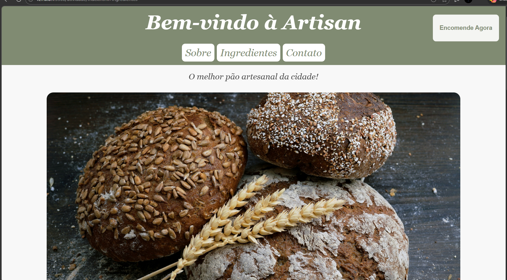
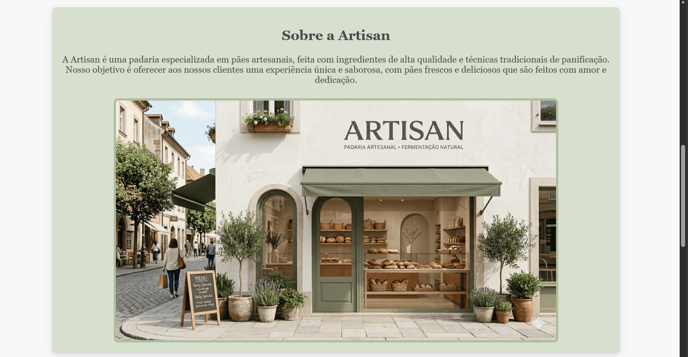
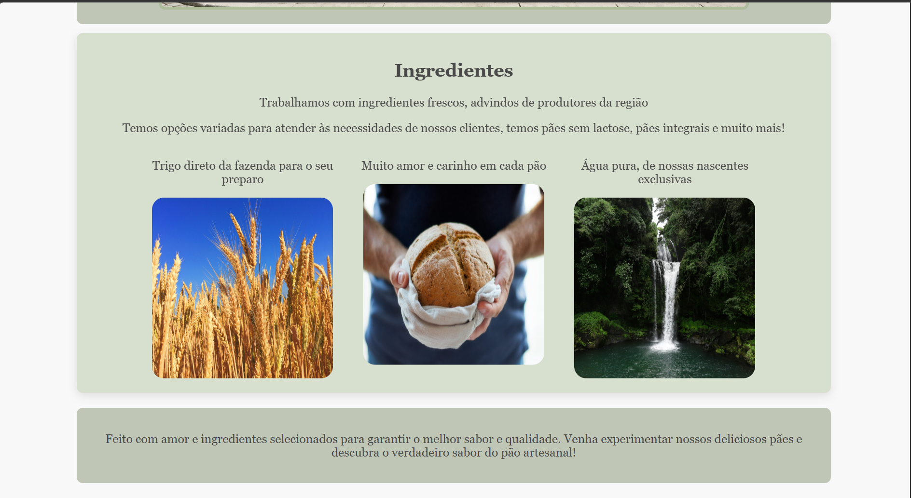
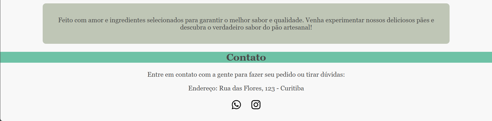

# Artisan - Padaria Artesanal

Este projeto foi desenvolvido como parte da **Aula 6**, com o objetivo principal de estudar e aplicar **Animações e Transições em CSS** (`@keyframes`, `animation` e `transition`).

## Sobre a Atividade

O desafio proposto para esta etapa foi:

> "Crie uma página para apresentar um produto ou serviço de sua escolha. A página deve usar animações em CSS para destacar informações e deixar a apresentação mais atrativa. Utilize `@keyframes` e `animation`. Seja criativo."

Para resolver esse desafio, optei por criar a **Artisan**, uma landing page para uma padaria focada em pães artesanais, ingredientes frescos e de alta qualidade.

## Animações e Efeitos Implementados

Para tornar a página fluida e atrativa, diversas animações customizadas foram criadas com CSS puro:

* **Entrada Dinâmica (`descerTopo` e `subirSecao`):** O cabeçalho desce suavemente ao carregar a página, enquanto as seções de conteúdo sobem, criando um efeito de montagem do layout.
* **Destaque de Texto (`aparecerSurgir`):** O slogan da padaria surge na tela com uma transição suave de opacidade e escala.
* **Imagens Flutuantes (`roverAbove`):** A imagem principal do pão artesanal possui um efeito contínuo de flutuação, dando vida à página.
* **Call to Action Pulsante (`piscarAviso`):** O botão de "Encomende Agora" pisca continuamente para chamar a atenção do usuário, parando e mudando de estilo no momento em que o mouse passa por cima (`:hover`).
* **Rodapé Animado (`transicaoCores`):** O título da seção de contato no rodapé transita suavemente entre diversos tons de verde em um loop infinito.
* **Interatividade (Hover & Transitions):** Cards de ingredientes, botões e links do menu reagem à interação do usuário elevando-se (`translateY`) e ganhando sombras (`box-shadow`).

## 🛠️ Tecnologias Utilizadas

* HTML5 (Semântico)
* CSS3 (Flexbox, Transições e Keyframes)

## 📸 Demonstração Visual

*Aqui estão algumas imagens de como o site ficou:*

*Visualização do cabeçalho animado e botão de encomenda.*

*Visualização da história da marca ficticia*

*Cards de ingredientes com efeitos de hover.*

*Informações de contato*