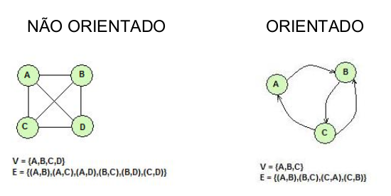

# Grafos

# Definição

- Conjunto de objetos (vértices) junto com uma coleção de
conexões entre pares de vértices.

- Grafo G(V, E): conjunto V de `vértices` e uma coleção E de pares
de vértices, chamados de `arestas`.

### Tipos de arestas

- **Dirigidas:** A aresta (u, v) é dita dirigida de u para v se o par (u, v) for
ordenado, com u precedendo v, ou seja, quando temos a indicação de sentido de onde a aresta sai e onde ela entra.

- **Não dirigida:** a aresta (u, v) é dita não-dirigida se o par (u, v) não for
ordenado; neste caso, (u, v) é o mesmo que (v, u), ou seja, quando a só temos a ligação nos ambos sentidos.

### Tipos de grafos

- Orientado: Grafos com arestas dirigidas.
- Não orientado: Grafos com arestas não dirigidas;

 

### Termologia

- **Vértices adjacentes**: há uma aresta entre eles.

- **Aresta incidente**: se o vértice for um dos pontos finais da
aresta.

- **Grau de um vértice**: número de arestas incidentes que saem ou entram nesse nó.
  + Grau de entrada: quantidade de arestas que entram no vértice.
  + Grau de saída: quantidade de arestas que saem do vértice.

***OBS:*** Vértices que não possuem arestas tem grau `0`.

- **Arestas paralelas ou múltiplas**: Arestas dirigidas ou não entre o
mesmo par de vértices.

- **Caminho:** Sequência alternada de vértices e arestas que se
inicia em um vértice e termina em um vértice de tal forma que
cada aresta seja incidente de seu antecessor e incidente em
seu sucessor.

- Ciclo: caminho em que os vértices de início e fim são os
mesmos.

***OBS:*** Quando todos os vértices do caminho ou ciclo são distintos,
exceto pelo primeiro e pelo último, o caminho ou ciclo é
`simples`.

- **Subgrafo de um grafo G:** grafo H cujos vértices e arestas são,
respectivamente, subconjuntos dos vértices e arestas de G.

- **Subgrafo de cobertura de G:** subgrafo de G que contém todos
os vértices de G.

- **Grafo conexo:** se para quaisquer dois vértices existir um
caminho entre eles.

Se um grafo G não for conexo, seus subgrafos conexos
maximais são chamados de componentes conexos de G.

- **Floresta:** um grafo sem ciclos.

- **Árvore:** floresta conexa, ou um grafo conexo acíclico.

***OBS:*** No contexto de grafos, uma árvore não possui raiz, sendo
chamada também de árvore livre.

- Se G for um grafo com m arestas, então a contribuição total
das arestas para os graus dos vértices é de duas vezes o
número de arestas.

Isso pode ser descrito pela seguinte relação:

$$
\sum _{v∈G} deg(v) = 2\cdot m
$$

Isso acontece por que ao somarmos os graus dos vértices em um vértice não direcionado contamos 2 vezes cada aresta.

- Em um grafo dirigido com m arestas, uma aresta (u, v)
contribui com uma unidade para o grau de saída de sua origem
u e uma unidade para o grau de entrada de seu destino v.

$$
\sum _{v∈G} indeg(v) = \sum _{v∈G} outdeg(v) =  m
$$

- Seja um grafo simples G com n vértices e m arestas. Se G for
não-dirigido:

$$
m \leq  \frac{n\cdot (n-2)}{2} 
$$

- Se G for dirigido:

$$
m \leq n \cdot (n-1)
$$

- Seja G um grafo não-dirigido com n vértices e m arestas.

  + Se G for conexo: $m \geq n-1$

  + Se G for uma árvore: $ m = n-1 $

  + Se G for uma floresta: $ m \leq n-1 $

# Como implementar um grafo?

Podemos usar as seguintes representações:

## Lista de adjacências

Espaço requerido: $O(m+n)$.

Muito usada quando o grafo é esparso, isto é, o número de
arestas $|E|$ é muito menor do que $|V|$.

Robusta, admitindo outras variantes de grafos. Por exemplo, é
possível incluir outras informações relativas a cada aresta,
como um valor ou peso.

`Desvantagem:` Não há um modo mais rápido para se determinar
se uma determinada aresta $(u, v)$ está presente no grafo do que
fazer uma busca linear(sequencial por exemplo) por v na lista de adjacências relativa à
u.

## Matriz de adjacência

Simplicidade

Permite a determinação de adjacências entre pares de vértices
em tempo constante.

`Desvantagem:` Espaço requerido para armazenamento da estrutura é O(n2),
sendo n o número de vértices do grafo.

## Lista de arestas

Espaço requerido para o armazenamento de uma lista de
arestas é $O(m+n)$.

`Desvantagem:` custo para acessar as arestas incidentes a um
determinado vértice, que requer uma inspeção exaustiva a
todas as arestas para determinar se são incidentes ao dado
vértice.

# Busca/percurso em grafos

Procedimento sistemático para explorar um grafo a partir de
um vértice inicial, visitando os vértices alcançáveis dele.

Um percurso será eficiente se ele visitar todos os vértices e
arestas em tempo proporcional ao seu número, ou seja, em
tempo linear $O(n)$.

## Percurso em profundidade

Generalização do percurso em ordem pré-fixada em uma
árvore.

Tem complexidade de tempo das listas de adjacências $O(n+m)$.

### Procedimento

- Visita um vértice e depois visita recursivamente todos os
vértices adjacentes a ele

- Deve visitar cada vértice somente uma vez.

- Como o grafo pode conter ciclos, a solução é manter um
registro dos nós que já foram visitados, de modo que o
percurso não entre em recorrência infinita

## Aplicações

- Encontrar um caminho de um vértice a outro.

- Determinar se um grafo é conexo ou não.

- Achar uma árvore de cobertura de um grafo conexo.

- Determinar se um grafo tem ciclos.

Entre muitas outras.

## Percurso em largura

Na busca em largura, utilizaremo uma `fila` (podendo ser uma fila de prioridades).

### Passo a passo

1. Escolher um vértice qualquer para iniciar.

2. Marcar esse vértice como visistado.

3. Visitar todos os vértices adjscentes ao vértice visitado.

    1. Marque vértices como visitados e insira->osem uma fila, na ordem que foram visitados.

4. Retire um vértice da fila

5. Se a fila estiver vazia, termine, senão volte ao passo 3.

<!-- 

Exemplo:

0   

`1`   ->   **6**   ->   **2**

2   ->   5   ->   3   ->   1   ->   6

3   ->   6   ->   5   ->   4   ->   2

4   ->   5   ->   3

5   ->   6   ->   4   ->   3   ->   2

6   ->   5   ->   3   ->   2   ->   1

Fila atual: 1->6->2

***
***

Próximo passo:

0   

`1`   ->   **6**   ->   **2**

2   ->   5   ->   3   ->   1   ->   6

3   ->   6   ->   5   ->   4   ->   2

4   ->   5   ->   3

5   ->   6   ->   4   ->   3   ->   2

6   ->   5   ->   3   ->   2   ->   1

Fila atual: 1->6->2

***
***

-->
# Referências

Material do professor Marcos e Marcio.