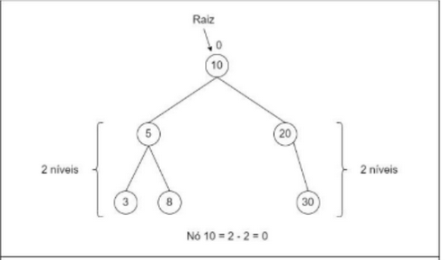

# Árvores AVL

São um tipo de árvore balanceada.

Respeitam as características de árvores binárias, e sua principal regra é:

+ Cada nó apresenta diferença de altura entre as sub-árvores direita e esquerda de 1,0 ou -1.

Vamos chamar de `qn` a altura de uma árvore, para facilitar vamos contar a quantidade de níveis dos nós.

O balanceamento de cada nó é calculado da seguinte forma:

$$ B = qn_{e} - qn_{d} $$

Sendo
+ $qn_{e}$ A quantidade de níveis da sub-árvore esquerda. 
+ $qn_{d}$ A quantidade de níveis da sub-árvore direita.

## E quando a árvore está desbalanceada?

Devemos fazer rotações, que podem ser:

+ Simples para direita.
+ Simples para esquerda.
+ Dupla com filho para a direita e pai para a esquerda.
+ Dupla com filho para a esquerda e pai para a direita.

## Regras de balanceamento

Se um a um nó pai está desbalanceado e se o filho tem um nó
com sinal de balanceamento do seu nível diferente, será feita
uma rotação dupla.

Caso contrário será feita uma rotação simples.

Pseudocódigo das rotações:

  Se nó N possui balanceamento 2

    Se filho esquerdo de N tem balanceamento 1

      Faça uma rotação direita no nó N

    Senão faça uma rotação esquerda no filho esquerdo de N e
               uma rotação direita em N

  Se nó N possui balanceamento -2

    Se filho direito de N tem balanceamento -1

      Faça uma rotação esquerda no nó N

    Senão faça uma rotação direita no filho direito de N e uma
               rotação esquerda em N 

## Caso do filho perdido

De vez em quando ao realizar rotações perdemos um nó.

Um nó pode ficar perdido e um pai sem filho, nesse caso temos duas abordagens:

+ O pai que perdeu o filho deve adotar o nó perdido.
+ Inserir novamente na árvore o nó

