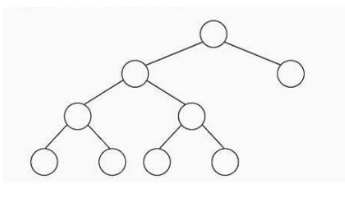
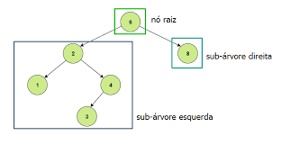
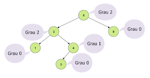
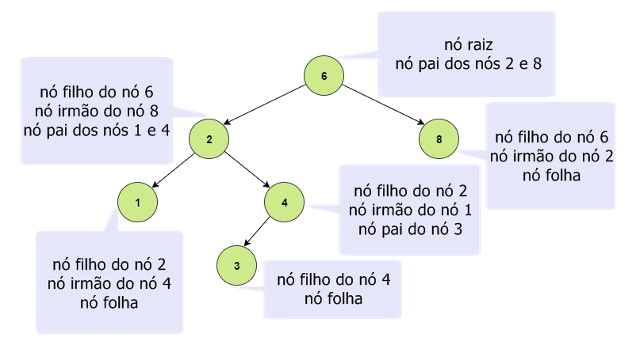
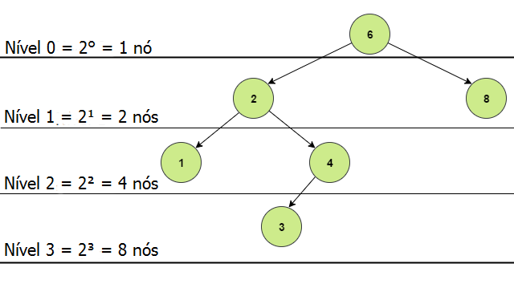
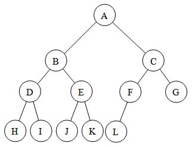
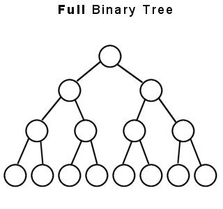
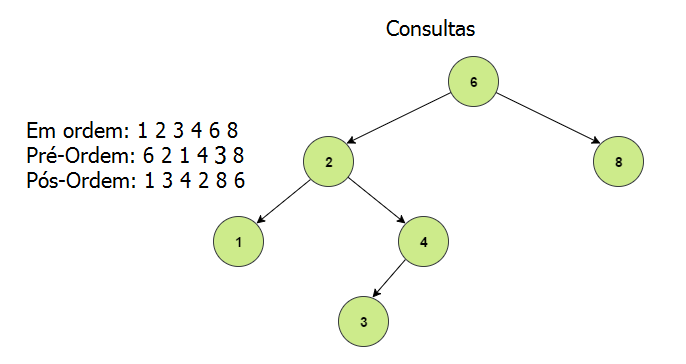

# Árvores Binárias

## Introdução

Árvores não são estruturas lineares, ou seja, nem todos os seus nós estão encadeados de forma sequencial.

Existem vários tipos de árvores, no entanto nos concentraremos nas árvores binárias.

Exemplo de árvore binária:



## Definição

Uma árvore binária é um conjunto finito de elementos, onde cada um deles é chamado de **nó**.

O primeiro elemento a ser inserido na árvore é chamado de **raiz**, é nele que todos os outros elementos serão ligados posteriormente.

Um conjunto de nós pode ser vazio, ou definido em três subconjuntos:

+ Raiz.
+ Sub-árvore direita.
+ Sub-árvore esquerda.

Exemplo:



## Conceitos importantes

### Propriedades de uma árvore binária

+ Todos os nós de uma sub-árvore direita são maiores que o nó raiz.
+ Todos os nós de uma sub-árvore esquerda são menores que o nó raiz.
+ Cada sub-árvore é também uma árvore binária.

### Grau de um elemento

O grau de um elemento é o número de subárvores que saem dele, com isso podemos concluir que o grau máximo de uma árvore binária é 2.

O grau de uma árvore é igual o grau máximo dos graus de todos os seus nós.



### Relações parentais

Nó pai é aquele que está logo acima e possui direta com o outro nó.

Nó filho é o nó abaixo e com ligação direta a outro nó ( raízes das sub-árvores).

Nós irmãos são nós que possuem o mesmo nó pai.

Nó folha é aquele que não possui filhos, seu grau logo é 0.

nó ancentral é aquele que está acima de um nó e possui ligação direta ou indireta .

Exemplo:



### Nível de um nó

É a distância de um nó até a raiz, log o nível da raiz é 0.


Exemplo:

### Altura de uma árvore

É o nível do nó mais distante da raiz.

A expressão que determina o número máximo de nós de um nível é $2^n$ , onde n é o nível do nó em questão.

Exemplo:




### Mais propriedades

#### Árvore estritamente binária

É a árvore em que todos os nós tem 0 ou 2 filhos.

A expressão de uma árvore estritamente binária é $2n-1$, onde n é o número de nós folha.

Exemplo:


#### Árvore completa

Todos os nós com menos de dois filhos ficam no último e penúltimo nível.

Exemplo:



#### Árvore cheia

Uma árvore com todos os pais com dois filhos

Exemplo:



## Percurso em árvores

Existem 3 tipos de percursos, vamos conhecê-los .

+ Pré-ordem.
+ Em ordem.
+ Pós-ordem.

### Pré-ordem

Percorremos a raiz, a sub-árvore esquerda e depois a sub-árvore direita.

**DICA:** Percorra a árvore desde a raiz fazendo uma linha, se a linha passar pela esquerda do nó você adiciona ele na listagem.

```C
    void preOrdem(no *atual){
        if(atual != NULL){
            printf("%d ",atual->valor);
            preOrdem(atual->esquerda);
            preOrdem(atual->direita);
        }
    }
```

### Em ordem

Percorremos a sub-árvore esquerda, a raiz e depois a sub-árvore direita.

**DICA:** Percorra a árvore desde a raiz fazendo uma linha, se a linha passar por baixo do nó você adiciona ele na listagem.

```C
    void emOrdem(no *atual){
        if(atual != NULL){
            emOrdem(atual->esquerda);
            printf("%d ",atual->valor);
            emOrdem(atual->direita);
        }
    }
```
## Pós-ordem

Percorremos a sub-árvore esquerda, depois a sub-árvore direita e por fim a raiz.

**DICA:** Percorra a árvore desde a raiz fazendo uma linha, se a linha passar pela direita do nó você adiciona ele na listagem.

```C
    void posOrdem(no *atual){
        if(atual != NULL){
            posOrdem(atual->esquerda);
            posOrdem(atual->direita);
            printf("%d ",atual->valor);            
        }
    }
```

Exemplo prático de tudo que vimos:



## Operações em árvores

+ Inserir um nó.
+ Remover um nó.
+ Consultar um nó.

Nas aulas focamos somente na inserção e na consulta de um nó devido a complexidade da remoção.

Agora vamos ver os algoritmos.

### Inserção de valores

Todo valor novo que é inserido em uma árvore deve ser uma folha.

Para realizarmos a implementação devemos declarar uma struct dessa forma

```C
    typedef struct no{
        int valor;
        struct no *direita;
        struct no *esquerda;
    }no ;
```
 E em seguida criarmos um ponteiro para a raiz, que podemos chamar de raiz.

```C
     no *raiz = NULL ;
```

Função que insere elementos implementada em C:

```C
    void Inserir(int valor){
        struct no *aux, *aux2 ;

        aux = (no*) malloc(sizeof(no));

        aux->valor = valor ;
        
        aux->esquerda = NULL;
        aux->direita = NULL;

        if(raiz == NULL){
            raiz = aux ;
        }
        else{

            aux2 = raiz ;

            while(1){
                if(aux->valor < aux2->valor){
                    if(aux2->esquerda == NULL){
                        aux2->esquerda = aux ;
                        return ;
                    }
                    else{
                        aux2 = aux2->esquerda ;
                    }
                }
                else{
                    if(aux2->direita == NULL){
                        aux2->direita = aux ;
                        return ;
                    }
                    else{
                        aux2 = aux2->direita ;
                    }
                }
            }
        }
    }
```
### Busca usando recursão

Aqui uma função que faz isso em linguagem C

``` C
void BuscaArvore(no *atual, int valor, int *existe){

    if(atual != NULL){
        BuscaArvore(atual->esquerda,valor,existe);
        if(atual->valor == valor){
            *existe = 1 ;
            return ;
        }
        BuscaArvore(atual->direita,valor,existe);
    }
}

```

Nesse casos fazemos a chamada dela assim

``` C
void menuBuscaArvore(){

    if(vazia()){
        return ;
    }

    int resultado = 0 , valor;

    printf("\n\nDIGITE O VALOR PARA BUSCAR --> ");
    scanf("%d",&valor);

    BuscaArvore(raiz,valor,&resultado);

    if(resultado){
        printf("\n\nVALOR %d ENCONTRADO!!\n\n",valor);
    }
    else{
        printf("\n\nVALOR %d NÃO ENCONTRADO!!\n\n",valor);
    }
}
```


## Referências

https://gabrielbueno072.github.io/rea-aed/aula_arv.html

Estruturas de Dados: Algoritmos, Análise da Complexidade e
Implementações em Java e C C++ - Ana Fernanda Gomes Ascencio

Estrutura de dados usando C - Aaron Ai Tenenbaum, Yedidyah
Langsam, Moshe J. Augenstein (ISBN 85-346-0348-0)